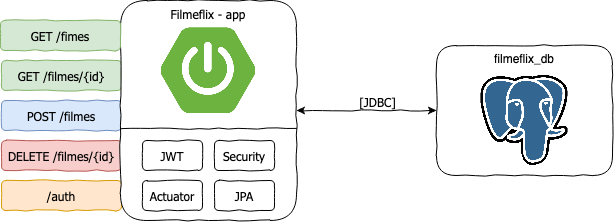

# Filmeflix

### Tecnologias envolvidas

* [Spring Boot](https://spring.io/projects/spring-boot)
* [PostgreSQL](https://www.postgresql.org/)
* Shell Script :shell:
* [Docker](https://www.docker.com/)
* [Swagger](https://swagger.io/)
* [JWT](https://jwt.io/)
* [Apache Maven](https://maven.apache.org/)

### Desenho Arquitetural da Solucação



### Subir Stack

Para subir a aplicação execute o script `./subir-stack.sh`

O que o script faz?

1. Compilação e geração de pacote `jar` da aplicação Java através do Maven
2. Criação da imagem docker com o pacote `jar` gerado anteriormente
3. Sobe a stack através `docker-compose` com a aplicação Java mais banco de dados
4. Validação se a aplicação está no ar 

Já para destruir a stack, basta executar o comando `./destruir-stack.sh`

:mag_right: **Observação**

Lembre-se que as permissões dos arquivos Shell Script devem ser alterados para execução. Para isso execute o comando abaixo.

```bash
chmod +x subir-stack.sh
chmod +x destruir-stack.sh
```

### Utilizando a aplicação

A documentação do Swagger pode ser acessada através do endereço: [http://localhost:8080/swagger-ui.html](http://localhost:8080/swagger-ui.html)

Como a API utiliza JWT para autenticação, as rotas com autenticação deve-se primeiro recuperar o Token passando usuário e senha, informado abaixo, que estão cadastrados no banco de dados.

```json
{
	"usuario": "filmeflix",
	"senha": "123"
}
```
:mag_right: **Observação**

O Token tem o período de expiracão de **24 horas**.